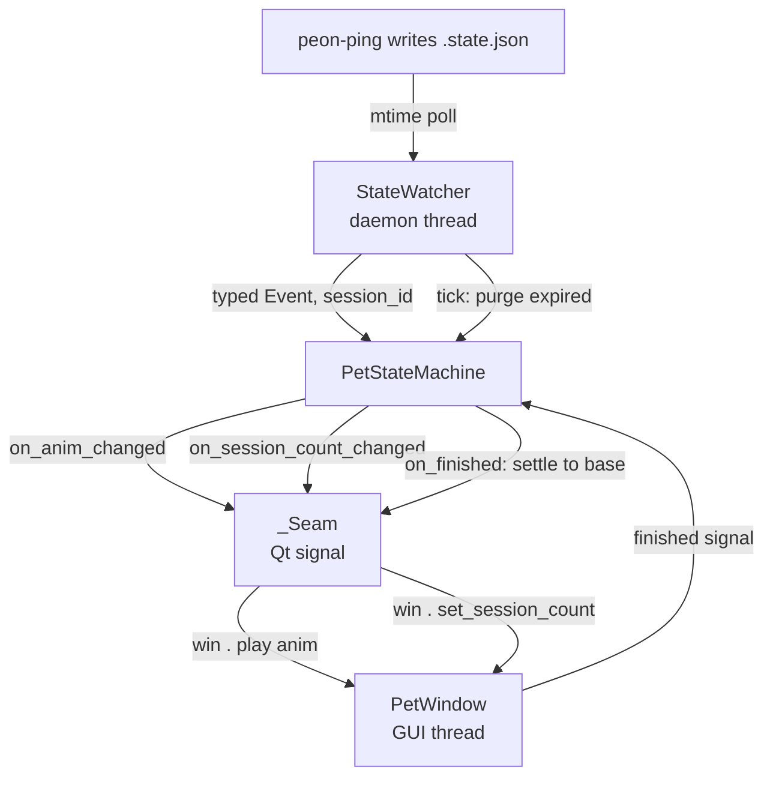

# Architecture

Peon Pet is a desktop pet that watches PeonPing's state file and animates a sprite in response. It's a small Python app
(~2800 LOC including tests) with a clear split between pure logic (trivially testable) and Qt wiring (one integration
test).

## The big picture

Two threads: the GUI thread runs `QApplication.exec()` and owns `PetWindow`; the watcher's daemon thread polls the state
file and drives the state machine. The state machine is pure Python (no Qt); it calls back into the GUI thread via
`_Seam`, a `QObject` with signals that `AutoConnection` marshals across threads.

## Modules

`../src/peon_pet`, top-down by dependency:

| Module        | Role                                                                                                                   | Qt? |
|---------------|------------------------------------------------------------------------------------------------------------------------|-----|
| `__main__.py` | Entry point.                                                                                                           | yes |
| `cli.py`      | Pure CLI helpers.                                                                                                      | no  |
| `window.py`   | `PetWindow` — frameless transparent always-on-top widget. Sprite atlas rendering, animation loop, drag, session badge. | yes |
| `tray.py`     | `TrayIcon` — system tray icon + context menu. Control surface, no state.                                               | yes |
| `state.py`    | `PetStateMachine` — translates peon-ping events into anims. Owns the session registry + dispatch.                      | no  |
| `events.py`   | `Event` enum + `EVENT_REACTION`/`KNOWN_EVENTS` — the peon-ping event vocabulary shared across modules.                 | no  |
| `watcher.py`  | `StateWatcher` — polls `.state.json` (mtime-based), parses to typed `Event`, `on_tick` each interval. Daemon thread.   | no  |
| `demo.py`     | `Demo` — cycles every `Anim` forever on a daemon thread. Visual QA mode.                                               | no  |
| `prefs.py`    | `Prefs` + `WindowPosition` — reads/validates `$XDG_CONFIG_HOME/peon-pet/config.json`.                                  | no  |
| `config.py`   | Static data: `Anim` enum, `ATLAS_LAYOUTS`, `ANIM_CONFIG` (playback + `effects` tuple of specs).                        | no  |
| `effects.py`  | Pure effect helpers + `EffectPlayer` / live effects (flash, shake, particles).                                         | no  |

## The state machine (the heart)

`PetStateMachine` (`state.py`) is the core logic. It owns a `_SessionRegistry`
of known sessions, each IDLE or ACTIVE, and translates peon-ping events into a target anim.

**Base anim** is `TYPING` if any session is ACTIVE, else `SLEEPING`. After a one-shot reaction plays out,
`PetWindow.finished` -> `state.on_finished()` -> settle to base.

**PostToolUseFailure as task-idle:** peon-ping's `PostToolUseFailure` is ambiguous - it fires both for a
genuine mid-session tool error and for a session that ended without a preceding `Stop`. The event carries no payload
to tell the two apart at arrival time. We treat it as a task-idle event (same as `Stop`) so the terminal case settles
to `SLEEPING` instead of typing until TTL. The tradeoff: a genuine mid-session tool failure briefly sleeps until the
next activity event wakes the session. In practice this flicker is invisible because peon-ping fires `PreToolUse` at
the start of the next tool call, which arrives within the agent's dispatch gap (sub-second in agentic loops). A
deferred-idle grace window could resolve the ambiguity but isn't worth the extra state and timer; the overload's cost
is accepted.

**Cold start:** the watcher replays the last event on startup with an empty registry. A cold event that registers a
session announces `WAKING` (regardless of its own reaction) so a cold `Stop` doesn't spuriously celebrate. A cold
`SessionEnd` (nothing to wake) falls through to base.

**Session TTL:** each session stores `last_seen` (refreshed on every event for that id). Entries with after a max idle
age are dropped by `PetStateMachine.purge_expired()`, the watcher's `on_tick` target (runs after each poll, including
when the file did not change). If purge changes the badge count,
`on_session_count_changed` fires; if it changes `base_anim`, `on_anim_changed` fires too.

## The state watcher

<!-- agnix-disable-next-line XP-003, false positive this describes the default watch path -->
`StateWatcher` (`watcher.py`) polls `$HOME/.claude/hooks/peon-ping/.state.json` on a daemon thread. PeonPing writes
atomically (tempfile + `os.replace`), which breaks `QFileSystemWatcher`'s inode watch, so we poll mtime instead. On a
new mtime with a newer timestamp, it parses `last_active` into a typed `(Event,
session_id)` and calls `on_event`. Unknown event names / missing fields are skipped at this read boundary (the only
place str->`Event` parsing happens).

After each poll wait, `on_tick` runs even when the file did not change (not during the initial `_emit_current` sync).
Watch mode wires `on_tick` to `state.purge_expired`. `stop()` joins the poll thread.

`poll_interval_s` is injectable (default 0.5s) so tests can run fast.

## Entry point: `main` vs `run`

`__main__.py` is split so the wired chain is testable:

- **`run(app, argv, ...) -> PetWindow`** — wires the app (window, watcher/demo, tray, seam) for the passed args and
  returns the window. Raises errors on bad input (bad anim name, bad atlas).
- **`main(argv, *, ...) -> None`** — parses args including preemptive exits and errors, creates the `QApplication`,
  calls `run`, catches errors to print a pretty `ERROR:`
  and exit 1, then blocks on `app.exec()`. The real entry point (`peon-pet` script, `__main__`).

The split lets integration tests call `run(...)` with a per-test `QApplication`
fixture and drive the event loop via `qtbot.waitUntil`, instead of fighting a blocking `app.exec()` owned by the
function under test.

## Single instance

`claim_single_instance` (`__main__.py`) uses a Qt local server named
`peon-pet`: a second launch connects to the first's socket and exits 1. The name is injectable so tests don't collide
with each other or a real instance.

## Tests

`../tests` mirrors `../src` one file per module, plus integration:

- **Unit tests** – the core of the coverage
- **Integration tests** (`test_main_integration.py`) — `run(app, [...])`
  end-to-end

See `../AGENTS.md` for the test style (AAA, `sut`, `Test*` classes, driver classes for internal-API testing).

### UI event handlers: not unit-tested

`PetWindow`'s event handlers (`mousePressEvent`, `mouseMoveEvent`, `paintEvent`, `_draw_badge`, etc.) are deliberately
not unit-tested. Calling them directly with a constructed `QMouseEvent` re-runs the handler body without Qt's event
dispatch — that's testing the math, not the integration, and Qt's involvement is the only thing that makes them
interesting.

Driving them through Qt's event system in tests requires either a display (CI runs `QT_QPA_PLATFORM=offscreen`) or
significant synthetic-event plumbing. The visual behavior is covered by
`--demo`; the state-side outcomes (position saved to `config.json`, session count, anim selection) are covered by the
unit + integration tests.

### Branch coverage and exhaustive `match`

coverage.py branch mode tracks runtime control-flow arcs, not type exhaustiveness. A `match` without `case _` still has
a fall-through exit when no case matches. For an exhaustive subject (e.g. `EffectSpec` =
`FlashConfig | ...` in `effects._spawn_live`), that exit is unreachable under the type contract, but coverage still
counts it as a missing branch (`N->exit` / `missing-branches=exit`). Same shape as
[pytest-cov#533](https://github.com/pytest-dev/pytest-cov/issues/533). Related wildcard false positives were fixed in
coverage.py; exhaustive class/enum matches without a wildcard still report this. Silence with
`# pragma: no branch`. Inventing a default case with `assert_never()` makes this worse as this will let basedpyright
ignore added new cases and turn them into runtime errors.

## CI

`../.github/workflows/ci.yml` runs two parallel jobs on every push/PR to `main`:

- **`check`** – runs format checks and static analysis.
- **`test`** — executes the tests and reports coverage.

